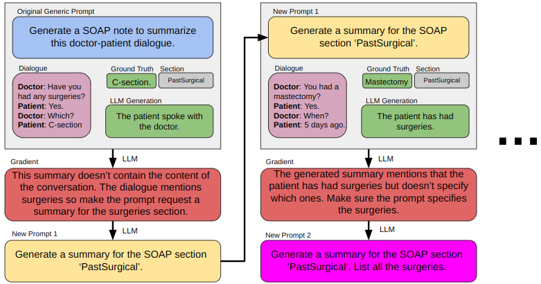

# Automatic Prompt Optimization for Medical Note Generation


## Introduction
In the world LLMs, the prompt can make or break the result. 
Crafting the proper prompt via prompt engineering is a common way to produce desired results. 
Automatic Prompt Optimization (APO) [(Pryzant et al., 2023)](https://arxiv.org/pdf/2305.03495.pdf) automizes the process by taking as input an initial prompt and optimizing it through iterations of criticisms and corrections using LLMs until a final, better prompt is produced.


 Physicians and medical experts spend a lot of time writing patient notes.
 One popular medical note format is SOAP [(Podder et al., 2021, 2023)](https://www.ncbi.nlm.nih.gov/books/NBK482263/).
 LLMs can help optimize this process.
 However, medical experts may lack the expertise to prompt engineer the perfect prompt that produces notes of their conversations with patients.
 To solve this, we propose a method that utilizes APO to take in a generic and basic prompt from a physician and transforms it into multiple prompts tailored for each SOAP section. 
 After comparing various LLMs, our results show that the GPT-4 APO variant is superior in prompt quality across medical note sections. 
 We also introduced a human-in-the-loop approach where medical experts edit the prompts resulting from our method to evaluate the impact of AI-human collaboration.
 The results show that medical experts maintain note content quality post-APO, with a preference for their own modifications, suggesting the value of expert customization. 
 Ultimately, we recommend a two-phase optimization process, leveraging APO-GPT4 for consistency and expert input for personalization.

 Please see our paper for further details: https://arxiv.org/pdf/2311.09684.pdf

## How to Run

## Citation
```
@misc{yao2023physicians,
      title={Do Physicians Know How to Prompt? The Need for Automatic Prompt Optimization Help in Clinical Note Generation}, 
      author={Zonghai Yao* and Ahmed Jaafar* and Beining Wang and Yue Zhu and Zhichao Yang and Hong Yu},
      year={2023},
      eprint={2311.09684},
      archivePrefix={arXiv},
      primaryClass={cs.CL}
}
```